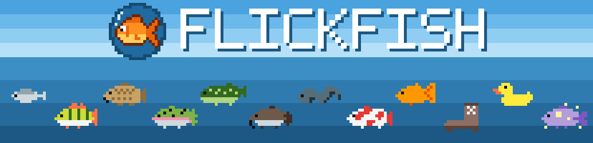

<p align="center"></p>

# FlickFish

A wrist-flick fishing mini game for Zepp OS square watches (Amazfit Active 2 Square, Bip 6, Active, GTS 4, …).

- **Flick your wrist to cast.** Then wait. Light buzzes are nibbles: flick now and you scare the fish off.
- **Long buzz = bite!** Turn or press the side button (or flick) within the hook window (shorter for rare fish).
- **Reel:** turn or press the side button (or tap) to wind the fish in; faster turning reels faster. When it fights back the watch pulses, and reeling then strains the line until it snaps. Reel when it's calm, stop when it buzzes; you can play it by feel.
- **12 catches** across dawn, day, dusk and night, including an Old Boot, a Rubber Duck and the legendary Moon Fish (night only, ~1% of casts).
- **Aquarium** (swipe up): every species you've caught, how many, and your biggest. Uncaught ones are silhouettes.
- The lake follows the time of day. Tapping the screen works as a flick too.

## Develop

```sh
npm install
npm test               # game logic + flick detector unit tests
npm run sprites        # regenerate PNGs (and docs/banner.png) from tools/sprites/art.mjs
                       #   (add `-- --preview sheet.png` for a contact sheet)
zeus dev               # run in the simulator
zeus preview           # QR code to install on the watch (Zepp app → Developer Mode → Scan)
zeus build             # .zab in dist/
python3 tools/store_screenshots.py   # 360x360 store screenshots in store/screenshots/
```

Store listing texts, privacy statement and asset checklist: `store/listing.md`.

Run `zeus preview` in a real terminal; its device picker needs arrow keys.

Set `DEBUG_ACCEL = true` in `page/lake/index.js` to show live accelerometer, crown and button-press values while tuning `FLICK_RATIO` in `lib/flick.js` and `CROWN_DEG_PER_UNIT` in the page.

Game logic lives in `lib/game.js` (pure, no `@zos` imports: a state machine that returns effects such as vibrations), the flick detector in `lib/flick.js`, storage in `lib/store.js`.

## License

[MIT](LICENSE) © 2026 Nils Flaschel
